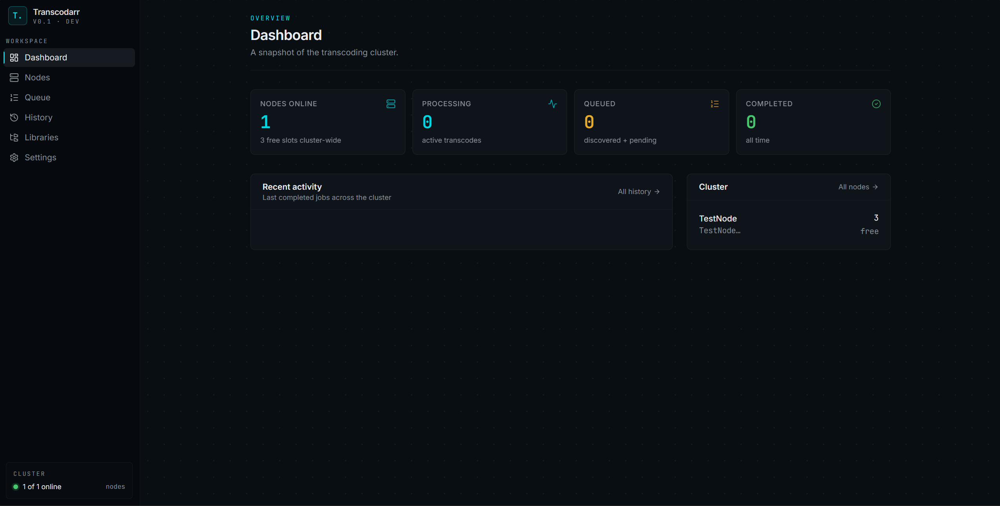
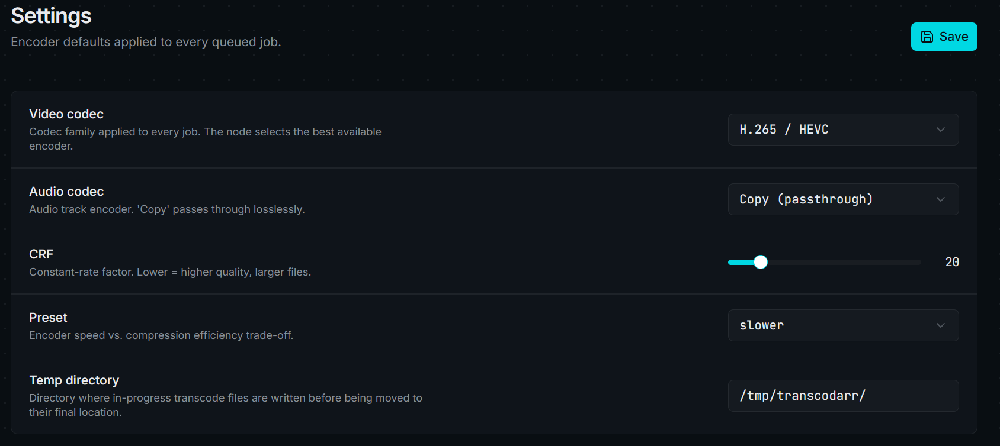
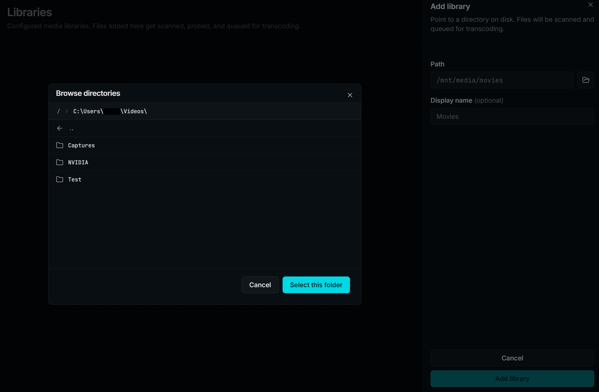
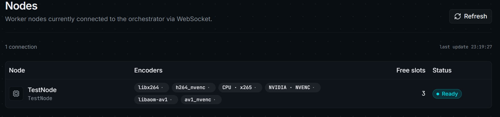
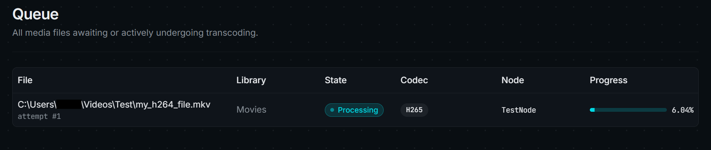
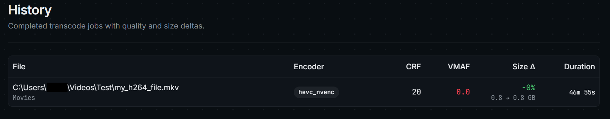

# Transcodarr
--- 
An Automated Transcoding System with multi node support.

## About
Transcodarr is deployed as a core that can utilize multiple nodes to dispatch transcode jobs to. The nodes are kept intentially slim such that they are easy to deploy on almost any system without needing too much infrastructure.

A node opens a connection to the core and tells the core its capabilities, i.e., the available codecs. Through the configuration made via the web ui of the core, the desired settings to be used by the all nodes when transcoding can be specified.

The core only orchestrates the jobs and does not do any media file specific handling itself. So even for a single system deployment a core and node will need to be running.

## Setup
To get Transcodarr running you will need to deploy both the core and node and configure the node to have the endpoint of the core. Either through the appsettings.json by setting the `NodeConfiguration:CoreUrl` to the address where the core is hosted at, or by setting `NodeConfiguration__CoreUrl` as an environment variable to the cores address.

The core ships and hosts the web ui itself and only needs to have its path for the sqlite db configured. Either in the appsetting.json `ConnectionStrings:TranscodarrDb` or as an environmment variable `ConnectionStrings__TranscodarrDb`

After having set up the core the web ui should be available

The first thing to configure through the ui are the main transcode settings

The next step is to configure the media libraries that should be managed by transcodarr. When selecting a library the directory and all its subdirectories are scanned for video files and will be automatically picked up.

For a file to be transcoded a node will have to be connected to the core, which can be seen in the Node menu. One important detail is that the node, as stated before, will determine which encoders are available to it and how many slots (concurrent jobs) it will be able to handle. 

If the desired encoder set in the config is not available on any node the file will not receive a job and stay as pending until a matching node is found. When a file is first found it will appear in the queue as discovered. Before the file can be processed a probe will need to be run to determine the required metadata. That will be handled by any given node because an ffprobe is cheap to run. After that the job will move into the pending state and wait for a free node. Once a free node is available the job will be dispatched to that node and enter the processing state

After the job completes the file will automatically be moved to replace the original file and the job can be found in the history tab, detailing both which files have already been processed, while also giving some deatils into the processing results. (The VMAF score is an in progress feature which will allow for quality gates to be configured for files to now always be accepted after transcoding)

